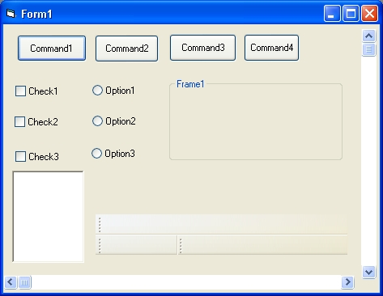

<div align="center">

## Using Windows Xp Themes In Your Programs


</div>

### Description

If your running Windows Xp and would like your programs to use the slick new buttons and other controls that xp does just copy this text in notepad and save it as "VB6.EXE.MANIFEST" and put it in the same directory as VB6.EXE and then you have to do one more thing to make the new controls stick when you make an EXE. First in the general declarations section put. Private Declare Function InitCommonControls Lib "comctl32.dll" () As Long

Then in the Form Initilize Event put.

InitCommonControls

Then for the final step copy this into notepad and save it as YourProjectsName.EXE.MANIFEST and include it in the same directory as your programs .EXE file. Copy the text that follows.

<?xml version="1.0" encoding="UTF-8" standalone="yes"?>

<assembly xmlns="urn:schemas-microsoft-com:asm.v1" manifestVersion="1.0">

<assemblyIdentity type="win32" processorArchitecture="*" version="6.0.0.0" name="mash"/>

<description>Enter your Description Here</description>

<dependency>

<dependentAssembly>

<assemblyIdentity

type="win32"

name="Microsoft.Windows.Common-Controls" version="6.0.0.0"

language="*"

processorArchitecture="*"

publicKeyToken="6595b64144ccf1df"

/>

</dependentAssembly>

</dependency>

</assembly>

Remember to do the last to steps for each form in your program.

Please leve any comments you may have.
 
### More Info
 


<span>             |<span>
---                |---
**Submitted On**   |
**By**             |[Cypher Software Solutions](https://github.com/Planet-Source-Code/PSCIndex/blob/master/ByAuthor/cypher-software-solutions.md)
**Level**          |Advanced
**User Rating**    |4.0 (52 globes from 13 users)
**Compatibility**  |VB 6\.0
**Category**       |[Complete Applications](https://github.com/Planet-Source-Code/PSCIndex/blob/master/ByCategory/complete-applications__1-27.md)
**World**          |[Visual Basic](https://github.com/Planet-Source-Code/PSCIndex/blob/master/ByWorld/visual-basic.md)
**Archive File**   |[](https://github.com/Planet-Source-Code/cypher-software-solutions-using-windows-xp-themes-in-your-programs__1-30973/archive/master.zip)


### Source Code

```
If your running Windows Xp and would like your programs to use the slick new buttons and other controls that xp does just copy this text in notepad and save it as "VB6.EXE.MANIFEST" and put it in the same directory as VB6.EXE and then you have to do one more thing to make the new controls stick when you make an EXE. First in the general declarations section put. Private Declare Function InitCommonControls Lib "comctl32.dll" () As Long
Then in the Form Initilize Event put.
InitCommonControls
Then for the final step copy this into notepad and save it as YourProjectsName.EXE.MANIFEST and include it in the same directory as your programs .EXE file. Copy the text that follows.
<?xml version="1.0" encoding="UTF-8" standalone="yes"?>
<assembly xmlns="urn:schemas-microsoft-com:asm.v1" manifestVersion="1.0">
<assemblyIdentity type="win32" processorArchitecture="*" version="6.0.0.0" name="mash"/>
<description>Enter your Description Here</description>
<dependency>
<dependentAssembly>
<assemblyIdentity
type="win32"
name="Microsoft.Windows.Common-Controls" version="6.0.0.0"
language="*"
processorArchitecture="*"
publicKeyToken="6595b64144ccf1df"
/>
</dependentAssembly>
</dependency>
</assembly>
Remember to do the last to steps for each form in your program.
Please leve any comments you may have.
```

